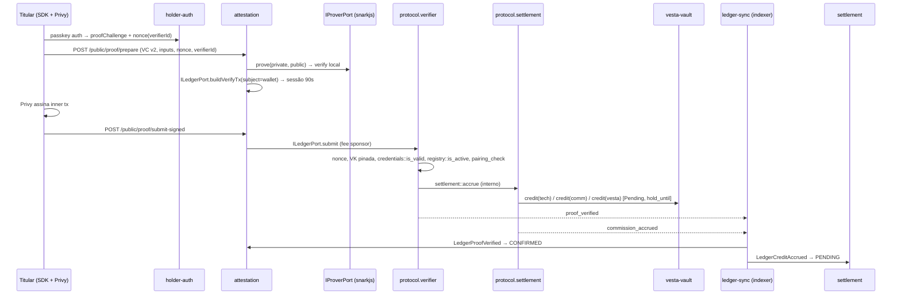

> **Status (2026-09-23):** proposta de setembro/2026, parcialmente descontinuada. Settlement, split on-chain e vault v3 saíram do roadmap (release "R4 — Arrumar a casa"). As seções de fronteira on/off-chain, threat model e eventos são insumo do ADR-001.

# Vesta v2 — Arquitetura de protocolo on-chain e reorganização do backend

Proposta de reestruturação para responder ao feedback do SCF e tornar o produto defensável como primitiva on-chain. Complementa `CONTEXTO-ESTUDO.md` (mapa do código atual) e `relatorio-auditoria-vesta-backend.md` (achados de higiene/segurança).

Data: 2026-09-17

---

## 0. Princípio único

**Soroban decide; o backend orquestra e indexa; Postgres é projeção.**

Hoje é o inverso: Postgres decide (validade, revogação, comissão) e o Soroban carimba. Tudo abaixo deriva de inverter essa fonte de verdade para as **quatro regras do protocolo**:

1. Uma verificação é válida se, e somente se, o contrato `vesta-protocol` emitiu `proof_verified`.
2. Uma credencial está revogada se, e somente se, o módulo `credentials` do contrato `vesta-protocol` diz que está.
3. Uma comissão existe se, e somente se, o módulo `settlement` a creditou no `vesta-vault`.
4. O split técnico/comercial é calculado pelo `settlement` a partir de termos versionados no `registry`.

Tudo o que **não** está nessa lista (PII, KYC pendente, Passkey, wallets, API keys, painel) continua off-chain, e isso é defensável: é dado privado ou operacional, não regra do protocolo.

---

## 1. Divisão on-chain / off-chain (resposta ao "on-chain KYC feasibility")

| Dado / decisão | Onde vive | Por quê | Se o backend Vesta for comprometido |
|---|---|---|---|
| CPF, nome, data, documento, biometria | Off-chain, no issuer. Vesta só vê em memória no prover | LGPD; não há motivo para ledger público | Atacante vê inputs em trânsito do prover (mitigação: prover isolado / client-side, §6.4) |
| Hashes Poseidon + salt + assinatura EdDSA do issuer (VC) | Device do titular (+ cópia cifrada para recovery) | É o material de prova; nunca vai on-chain em claro | Nada muda: a VC só serve com o CPF real |
| `vc_commitment` + `issuer` + `expires_at` + `credential_type` | **On-chain** (`protocol.anchor`) | Ciclo de vida verificável; métrica de adoção auditável | Atacante pode ancorar lixo assinado com chave de issuer custodiada (mitigação: KMS + rate limit + issuer pode revogar) |
| Revogação | **On-chain** (`protocol.revoke`) | Verifier precisa checar sem confiar na Vesta | Atacante pode revogar (DoS), não pode "des-revogar" |
| Chave de verificação Groth16 | **On-chain**, `instance` storage do `verifier` | Sem isso o contrato aceita qualquer circuito | Nenhum efeito: só admin multisig altera |
| Nonce anti-replay | **On-chain**, `temporary` storage do `verifier` | One-time precisa ser verificável | Nenhum efeito |
| Attestation (resultado) | **On-chain** (evento + storage) | É o produto | Nenhum efeito |
| Preço por reuso, `share_bps`, roles | **On-chain**, `registry`, versionados | Comissão precisa ser derivada, não informada | Atacante não altera termos (admin multisig); backend não participa do cálculo |
| Crédito de comissão, hold, reversão, saque | **On-chain**, `vault` | Custódia de valor | Operator comprometido só pode `settle` para o `payout_address` registrado; guardian pausa |
| Status KYC pendente/aprovado (webhook) | Off-chain | É pré-emissão; nada a verificar ainda | Sem impacto on-chain |
| Passkey, challenge de sessão, JWT, API key | Off-chain (Redis/PG) | Autenticação de borda | Ver §7 (Privy) |
| Ledger de comissão, painel, CSV | Off-chain, **projeção de eventos** | UX | Projeção pode divergir; reconciliação detecta (§5.4) |

O ciclo de vida do KYC no Soroban é, portanto: **`anchor` → N × `verify` → `revoke`** (ou expiração pelo `expires_at` ancorado). Emissão do KYC em si e recovery ficam fora.

---

## 2. Camada de protocolo — dois contratos

> Correção em relação à primeira versão desta proposta (5 contratos). Aquela separação veio de reflexo EVM (limite de bytecode, upgrade granular por responsabilidade). No Stellar isso custa e não rende. Referências: [smart-contracts/development.md](https://github.com/stellar/stellar-dev-skill/blob/main/skills/smart-contracts/development.md) ("reduce cross-contract calls in hot paths; each is full invocation overhead"; tx é a fronteira atômica; reentrância bloqueada pelo host; WASM até 128 KB), [zk-proofs/SKILL.md](https://github.com/stellar/stellar-dev-skill/blob/main/skills/zk-proofs/SKILL.md) ("policy-and-proof split" pode ser módulo, não contrato), e [OpenZeppelin stellar-contracts/Architecture.md](https://github.com/OpenZeppelin/stellar-contracts/blob/main/Architecture.md) (um deploy composto de módulos com storage keys isoladas).

**Regra para separar contrato:** governança/chaves distintas, cadência de upgrade distinta, ou reuso por terceiros. Só o cofre cumpre isso.

| Contrato | Módulos Rust internos | Por que é um contrato |
|---|---|---|
| `vesta-protocol` | `registry`, `credentials`, `verifier`, `settlement` | Um admin, um upgrade, storage keys isoladas por módulo (`RegistryKey::*`, `CredentialKey::*`, …). `verify_proof` não faz nenhuma cross-call exceto `vault.credit`. |
| `vesta-vault` | — | Custodia tokens: chaves `operator`/`guardian` próprias, pausável isolado, raramente atualizado, superfície de auditoria mínima (security.md: controles de emergência para contratos com valor). |

```mermaid
flowchart LR
  U[Wallet do titular\n(Privy) — source da tx] -->|verify_proof| P
  subgraph P[vesta-protocol]
    direction TB
    V[verifier] --> C[credentials]
    V --> R[registry]
    V --> S[settlement]
    S --> R
  end
  S -->|credit| W[vesta-vault]
  K[Keeper Vesta] -->|mature| W
  O[Operator Vesta] -->|settle| W
  G[Guardian] -->|reverse / pause| W
  I[Issuer / Vesta delegado] -->|anchor / revoke| C
  A[Admin multisig] -->|register / set_terms / set_vk / upgrade| P
```

`vault.credit` só aceita `vesta-protocol` como invocador (auth implícita de contrato chamador). Dentro do `protocol`, `settlement::accrue` é função interna chamada por `verifier::verify_proof` — não é entrypoint público. Isso remove a "chave operadora que credita o que quiser", o vetor real de colusão hoje.

Organização do crate:

```
contracts/vesta-protocol/src/
├── lib.rs           # #[contract] + #[contractimpl] expondo as funções públicas de cada módulo
├── storage.rs       # enums de DataKey por módulo (sem colisão) + helpers de TTL
├── errors.rs        # um #[contracterror] único, códigos nunca renumerados
├── events.rs        # #[contractevent] tipados
├── registry.rs      # participantes, termos versionados, preços
├── credentials.rs   # anchor / revoke / is_valid
├── verifier.rs      # VK pinada, nonce, pairing, attestation
├── settlement.rs    # split por bps → vault.credit
└── test/            # unit por módulo + fluxo completo
```

As seções a seguir descrevem cada módulo. Assinaturas são as funções públicas expostas por `lib.rs`.

### 2.1 Módulo `registry` (evolução do issuer-registry)

Cadastra **participantes**: issuers *e* verifiers (hoje verifier é só tabela Postgres).

```rust
pub struct Participant {
    did: String,
    kind: ParticipantKind,            // Issuer | Verifier | Both
    roles: Vec<IssuerRole>,           // Technical | Commercial (só Issuer)
    stellar_address: Address,         // payout + auth de revogação
    signing_pubkey: Option<BytesN<64>>, // EdDSA BabyJubJub (Ax, Ay) — só Issuer
    authorized_credential_types: Vec<Symbol>,
    status: ParticipantStatus,
    terms_version: u32,
    registered_at: u64, updated_at: u64,
}

pub struct CommissionTerms {          // versionado: DataKey::Terms(did_hash, version)
    technical_bps: u32,
    commercial_bps: u32,
    vesta_bps: u32,                   // soma == 10_000
    effective_from: u64,
}

pub struct CredentialTypePrice {      // DataKey::Price(credential_type)
    amount_atomic: i128,              // por reuso
    token: Address,
}
```

Funções: `register_participant`, `update_participant`, `set_status`, `set_terms` (cria nova versão, nunca sobrescreve), `set_price`, `get_participant`, `get_terms(did_hash, version)`, `get_current_terms`, `get_price`, `is_active`.

Governança: `admin` é uma conta Stellar **multisig** (threshold nativo do Stellar), não uma S-key única. `upgrade` com mesmo admin.

Chave EdDSA do issuer: v2 default = **custódia delegada** em KMS/HSM da Vesta, uma chave por issuer, registrada aqui. Opção futura "bring your own key" via SDK. A decisão fica explícita no threat model (§7).

### 2.2 Módulo `credentials` (novo)

```rust
pub struct CredentialRecord {
    issuer_did_hash: BytesN<32>,
    credential_type: Symbol,
    expires_at: u64,
    anchored_at: u64,
    revoked_at: Option<u64>,
}
// DataKey::Credential(vc_commitment: BytesN<32>)
```

- `anchor(vc_commitment, issuer_did, credential_type, expires_at)` — `require_auth` do `stellar_address` do issuer registrado (ou admin Vesta em modo delegado). Checa issuer `Active` e `credential_type` autorizado no `registry` (leitura interna, mesma instância). Emite `credential_anchored`.
- `revoke(vc_commitment, reason: Symbol)` — mesma auth. Idempotente. Emite `credential_revoked`.
- `is_valid(vc_commitment, now) -> Result<CredentialRecord, Error>` — `NotAnchored | Revoked | Expired`. Público.

Por que ancorar na emissão: fecha o ciclo de vida on-chain, gera métrica de adoção verificável ("credenciais emitidas" lidas do RPC), e permite ao `verifier` checar expiração sem colocar tempo dentro do circuito. Custo: uma tx por emissão, **assíncrona via outbox** (§5.2) — a API de emissão continua respondendo em milissegundos; a credencial nasce `ANCHOR_PENDING` e só pode ser verificada depois de `credential_anchored`. Se o volume justificar, v3 pode ancorar raiz de Merkle por lote.

### 2.3 Módulo `verifier` v2

Só criptografia e binding. Economia fica em `settlement`, cadastro em `registry`.

```rust
pub struct VerifyingKey { alpha: BytesN<64>, beta: BytesN<128>, gamma: BytesN<128>, delta: BytesN<128>, ic: Vec<BytesN<64>> }
// instance: Admin, Vk, VaultContract
// temporary: Nonce(BytesN<32>) -> ()  TTL ≈ 1 dia
// persistent: Attestation(attestation_id) -> Attestation

pub struct PublicSignals {        // ordem fixa == ordem do circuito
    kyc_ok: bool,                 // output do circuito (deve ser 1)
    vc_commitment: BytesN<32>,
    issuer_pubkey_hash: BytesN<32>,
    min_kyc_level: u32,
    nonce: BytesN<32>,
    verifier_did_hash: BytesN<32>,
}

pub fn verify_proof(
    env: Env,
    subject: Address,             // wallet do titular — require_auth
    proof_a: BytesN<64>, proof_b: BytesN<128>, proof_c: BytesN<64>,
    signals: PublicSignals,
) -> Result<Attestation, Error>
```

Sequência interna:

1. `subject.require_auth()` — quem apresenta é o titular (ou relayer autorizado por ele, ver §7).
2. `signals.kyc_ok == true` senão `Error::ProofRejected`.
3. `Nonce(nonce)` não existe em temporary → grava. Senão `Error::NonceUsed`.
4. `registry::is_active(verifier_did_hash)` (leitura interna) senão `Error::VerifierInactive`.
5. `credentials::is_valid(vc_commitment, ledger.timestamp())` → record. Compara `record.issuer` com `issuer_pubkey_hash` via `registry::get_participant` senão `Error::IssuerMismatch`.
6. `pairing_check` com **VK do storage** e `vk_x` montado a partir de `signals` serializados na ordem do circuito. Falha → `Error::InvalidProof`. **Nada é gravado em falha.**
7. `attestation_id = sha256(vc_commitment || verifier_did_hash || nonce)`. Grava `Attestation{…, ledger_seq, timestamp}`.
8. `settlement::accrue(attestation_id, vc_commitment, issuer_did_hash, verifier_did_hash, credential_type)` — função interna, única cross-call é para o vault.
9. Emite `proof_verified { attestation_id, vc_commitment, verifier_did_hash, min_kyc_level, ledger_seq }`.

Usar `__constructor(admin, vk, vault)` em vez de `initialize` guardado (security.md §3: construtor não pode ser re-executado). `set_vk` só admin, emite evento com hash da VK (trocar circuito é evento público).

Validar cedo com `stellar contract invoke --send=no`: `pairing_check` (4 pares) + leituras de storage + 1 cross-call para o vault, dentro de 400M instruções e 200 entradas lidas/escritas. Com um só contrato o orçamento fica folgado; se ainda assim apertar, o fallback é `verify_proof` **emitir evento** e o keeper chamar um entrypoint `accrue_for(attestation_id)` em tx separada — ainda determinístico, só assíncrono.

### 2.4 Módulo `settlement` (novo)

Economia. Sem criptografia, sem custódia.

```rust
pub(crate) fn accrue(env, attestation_id, vc_commitment, issuer_did_hash, verifier_did_hash, credential_type) -> Result<Accrual, Error>
```

1. Função interna (`pub(crate)`), só `verifier::verify_proof` chama — não existe entrypoint público para acumular.
2. `price = registry::get_price(credential_type)`.
3. `issuer = registry::get_participant(issuer_did_hash)`; `terms = registry::get_terms(issuer_did_hash, issuer.terms_version)`. **O crédito referencia a versão de termos** — mudar termos não altera créditos passados.
4. Resolve beneficiários:
   - técnico = issuer (sempre);
   - comercial = `verifier` se ele tiver role `Commercial`, senão o issuer se tiver, senão Vesta (regra explícita; decisão de produto documentada no §9);
   - Vesta = `vesta_bps`.
5. Split determinístico: `tech = price * technical_bps / 10_000`, `comm = price * commercial_bps / 10_000`, `vesta = price - tech - comm` (resto de arredondamento vai para a Vesta, nunca para um issuer — evita disputa por centavos).
6. Para cada beneficiário com valor > 0: `vault.credit(credit_id = sha256(attestation_id || role), beneficiary = did_hash, amount, hold_until = now + HOLD_SECS, ref = vc_commitment)`.
7. Emite `commission_accrued { attestation_id, vc_commitment, terms_version, splits: Vec<(role, did_hash, amount)> }`.

Também: `reverse_for_credential(vc_commitment)` — chamável pelo guardian após `credential_revoked`; reverte todos os créditos **ainda em hold** daquela credencial (índice `CreditsByCredential(vc_commitment) -> Vec<credit_id>`). Créditos já maduros/sacados **não** são recuperáveis — regra declarada.

### 2.5 Contrato `vesta-vault` v3

Custódia com hold e disputa.

```rust
pub struct Credit { beneficiary: BytesN<32>, amount: i128, hold_until: u64, state: CreditState, ref_: BytesN<32> }
pub enum CreditState { Pending, Available, Reversed, Settled }
// Balance(beneficiary) -> { pending: i128, available: i128 }
```

- `credit(...)` — `protocol_contract.require_auth()` (endereço lido do storage; auth implícita porque o `protocol` é o invocador direto — development.md "auth trees"). Rejeita `credit_id` duplicado (já existe). Soma em `pending`.
- `mature(credit_ids: Vec<BytesN<32>>)` — **permissionless** (keeper Vesta chama, mas qualquer um pode): para cada crédito `Pending` com `hold_until <= now`, move para `Available`. Emite `commission_matured`.
- `reverse(credit_id, reason)` — `guardian.require_auth()`, só se `Pending`. Emite `commission_reversed`.
- `settle(payout_id, beneficiary, amount)` — `operator.require_auth()`; destino é **sempre** `registry.get_participant(beneficiary).stellar_address` (não parâmetro). Só `available`. Emite `payout_settled`.
- `pause`/`unpause`, `set_operator`, `set_guardian`, `set_protocol`, `upgrade` — admin multisig, exceto `pause` (guardian). Destino de `settle` vem de `protocol.get_participant(beneficiary).stellar_address` — a única cross-call do vault, fora do hot path.

Papéis de chave (todas distintas, ver relatório S-07): `admin` (multisig, frio), `operator` (settle; quente, saldo limitado), `guardian` (pause/reverse; pode ser multisig 1-de-N com pessoas do time), `keeper` (mature; sem poder), `deployer` (fee-bump; sem papel nos contratos).

### 2.6 Eventos on-chain (contrato de integração com o backend)

| Contrato / módulo | Evento | Consumidor no backend |
|---|---|---|
| protocol / registry | `participant_registered/updated/status`, `terms_set`, `price_set` | `participant` (projeção) |
| protocol / credentials | `credential_anchored`, `credential_revoked` | `credential` (status da projeção) |
| protocol / verifier | `proof_verified`, `vk_set` | `attestation` (projeção), `backoffice` |
| protocol / settlement | `commission_accrued`, `commission_reversed_for_credential` | `settlement` (ledger) |
| vault | `commission_matured`, `commission_reversed`, `payout_settled`, `deposit`, `paused` | `settlement` (ledger, saques) |

Todos os eventos são `#[contractevent]` tipados com o módulo como primeiro topic (`("vesta", "registry", …)`), para o indexer filtrar por módulo sem decodificar o payload.

Todo evento carrega ids determinísticos (`attestation_id`, `credit_id`, `payout_id`) — o backend nunca "inventa" id de coisa on-chain; deriva ou lê.

---

## 3. Circuito v2 (`vesta_kyc_v2.circom`)

Hoje o circuito prova "conheço pré-imagens de três hashes e `kyc_level ≥ min`". Precisa provar **"um issuer registrado assinou esta credencial, ela é esta (`vc_commitment`), e estou apresentando-a para este verifier com este nonce"**.

```
// privados
signal input cpf; birth_date; full_name; kyc_level; salt;
signal input sig_R8x; sig_R8y; sig_S;
signal input issuer_Ax; issuer_Ay;

// públicos (ordem == PublicSignals do contrato)
signal output kyc_ok;
signal input  vc_commitment;
signal input  issuer_pubkey_hash;
signal input  min_kyc_level;
signal input  nonce;              // não constrangido: só amarra a prova
signal input  verifier_did_hash;  // idem

// restrições
cpf_hash        = Poseidon(cpf)
birth_hash      = Poseidon(birth_date)
name_hash       = Poseidon(full_name)
vc_commitment  === Poseidon(cpf_hash, birth_hash, name_hash, kyc_level, salt)
issuer_pubkey_hash === Poseidon(issuer_Ax, issuer_Ay)
EdDSAPoseidonVerifier(issuer_Ax, issuer_Ay, sig_S, sig_R8x, sig_R8y, M = vc_commitment)
kyc_ok = GreaterEqThan(kyc_level, min_kyc_level)
```

Notas:
- `salt` por credencial impede que a mesma pessoa gere o mesmo `vc_commitment` em dois issuers (linkabilidade entre issuers).
- `nonce` e `verifier_did_hash` entram só como sinais públicos: o `vk_x` do Groth16 os amarra à prova. Um replay em outro verifier ou com outro nonce falha no `pairing_check`.
- EdDSA-Poseidon do circomlib: ordem de ~5k constraints; total do circuito continua pequeno.
- **Novo trusted setup**. VCs v1 ficam inválidas. Plano de reemissão para qualquer credencial real; deleção para teste.
- `verification_key.json` vira **artefato de release** com checksum; o backend recusa boot se o hash da VK local não bater com `verifier.get_vk_hash()` on-chain (substitui o "mock liga sozinho", S-08).

VC v2 (documento no device): mantém W3C, `credentialSubject` passa a ter `commitment`, `salt`, `kycLevel`, hashes; `proof` passa a ser `{ type: "EdDSAPoseidonSignature2025", issuerPubkey, R8, S }` — assinatura de verdade, não SHA-256.

---

## 4. Backend — organização em camadas

### 4.1 Problema atual e referência adotada

Quatro estilos convivendo (relatório A-01); três clientes Soroban independentes; `proof` escreve na tabela de `commission`; processors com `setInterval`; fonte de verdade no Postgres.

**Referência adotada: o backend da Block (`blockbr/bbr-aws-app-ecs-backend`).** Ele já resolve os mesmos problemas com a mesma stack (NestJS/CQRS/Prisma) e tem duas coisas que a Vesta precisa copiar literalmente:

1. O padrão de módulo de `.cursor/rules/standard-module.mdc` (`api/{public,backoffice,common}`, `application/{public,backoffice,internal}` com sagas, `domain/{events,entities,repositories}`, `infra/{mappers,repositories,dao,cron}`).
2. O padrão `infra/gateways/{ports,factories,providers}`: o domínio depende de uma **porta** (`IKycPort`, `IPaymentPort`…), uma **factory** escolhe o provider por configuração, e cada **provider** (Celcoin, Hiperbanco, Veriff…) traduz para o vocabulário do domínio na borda. É exatamente isso que torna a Vesta agnóstica à blockchain sem inventar framework: uma porta `ILedgerPort`, um provider `stellar`, um provider `mock` para testes.

Sobre agnosticidade, com honestidade: o que fica agnóstico é o **domínio e a aplicação** (entidades, handlers, eventos, projeções). O circuito ZK, a codificação de pontos BN254, a semântica dos contratos e a custódia Privy são específicos da Stellar e vivem no provider. Trocar de chain significa reescrever o provider e reimplantar contratos equivalentes — não significa que o backend "roda em qualquer chain". Não construir abstração multi-chain além da porta: uma interface, uma implementação real, uma mock.

### 4.2 Estrutura proposta

```
app/src/
├── main.ts / app.module.ts
├── infra/                               # cross-cutting, sem regra de negócio (igual Block)
│   ├── auth/                            # guards, api-key (hash), admin, JWT
│   ├── database/                        # prisma, migrations, seeds
│   ├── env/                             # zod, obrigatório por NODE_ENV
│   ├── cache/                           # redis (challenges, sessions, locks)
│   ├── cipher/                          # KMS/HSM: assinatura EdDSA do issuer e chaves Stellar por papel (Block tem cipher/)
│   ├── scheduler/                       # crons registrados (Block tem scheduler/)
│   ├── logging/  swagger/
│   └── gateways/                        # padrão Block: ports → factories → providers
│       ├── ports/
│       │   ├── ledger.port.ts           # ILedgerPort (ver abaixo)
│       │   ├── ledger-events.port.ts    # ILedgerEventsPort: pull(cursor) → LedgerEvent[] normalizados
│       │   ├── prover.port.ts           # IProverPort: prove(inputs) → { proof, publicSignals }
│       │   ├── signer.port.ts           # ISignerPort: sign(role, payload)
│       │   └── custody.port.ts          # ICustodyPort: wallet do titular / org (Privy hoje)
│       ├── factories/                   # ledger.factory.ts, prover.factory.ts, custody.factory.ts — escolhem por env
│       └── providers/
│           ├── stellar/                 # bindings TS gerados dos 2 contratos, encoders BN254, RPC client,
│           │                            #   fee-bump, mappers evento-Soroban → LedgerEvent, deployments/{testnet,mainnet}.json
│           ├── snarkjs/                 # prover em worker pool; manifest de artefatos + checagem de hash da VK
│           ├── privy/                   # custody provider
│           └── mock/                    # ledger em memória (anchor/verify/credit determinísticos) para unit/integration
│
├── modules/                             # cada um com a estrutura de standard-module.mdc da Block
│   ├── participant/                     # issuers + verifiers, termos, preços     ← era issuer + backoffice/verifiers + admin-issuers.controller
│   ├── credential/                      # emissão, anchor, kyc-status, revogação, verify
│   ├── holder-auth/                     # challenge, passkey, recovery, nonce      ← era challenge
│   ├── wallet/                          # wallets titular/org via ICustodyPort
│   ├── attestation/                     # prepare / submit / projeção proof_verified ← era proof
│   ├── settlement/                      # ledger (projeção), saques, keeper mature  ← era commission
│   ├── ledger-sync/                     # outbox (comandos on-chain) + indexer (cursor, eventos → DomainEvents)
│   └── backoffice/                      # só DAOs de leitura + ações de perfil
│
└── shared/                              # value objects, tipos, eventos base, erros semânticos
```

A porta central:

```ts
// infra/gateways/ports/ledger.port.ts — vocabulário do DOMÍNIO, zero tipos Stellar
export interface ILedgerPort {
  // participant
  registerParticipant(input: RegisterParticipantInput): Promise<UnsignedTx>;
  setTerms(input: SetTermsInput): Promise<UnsignedTx>;
  // credential
  anchorCredential(input: { commitment: Hex32; issuerDid: string; type: string; expiresAt: Date }): Promise<UnsignedTx>;
  revokeCredential(input: { commitment: Hex32; reason: string }): Promise<UnsignedTx>;
  getCredentialStatus(commitment: Hex32): Promise<CredentialStatus>;
  // attestation
  buildVerifyTx(input: { subject: WalletAddress; proof: Proof; signals: PublicSignals }): Promise<UnsignedTx>;
  // settlement
  matureCredits(creditIds: Hex32[]): Promise<UnsignedTx>;
  settle(input: { payoutId: Hex32; beneficiary: Hex32; amount: bigint }): Promise<UnsignedTx>;
  getBalance(beneficiary: Hex32): Promise<{ pending: bigint; available: bigint }>;
  // submit
  submit(tx: SignedTx, opts?: { sponsorFees?: boolean }): Promise<TxReceipt>;
}
```

`UnsignedTx`/`SignedTx` são opacos (`{ provider: "stellar"; payload: string }`) — o domínio não decodifica XDR. O provider Stellar é a **única** pasta que importa `@stellar/stellar-sdk`; regra de lint.

Regras de dependência (validar com `dependency-cruiser`, como a Block valida via rules):

- `modules/*` → `infra/gateways/ports/*`, `infra/*`, `shared/*`. **Nunca** `infra/gateways/providers/*`.
- `infra/gateways/providers/*` → só `ports/*` e `shared/*`. Não importa `modules/*`.
- `ledger-sync` é o único módulo que chama `ILedgerEventsPort` e o único que escreve em `onchain_outbox`/`ledger_cursors`. Ele publica `DomainEvents` (`LedgerProofVerified`, `LedgerCreditAccrued`…); os outros módulos reagem em sagas `application/internal/*.saga.ts` (padrão Block, ex.: `token-internal.saga.ts`).
- Um módulo **não** escreve na tabela de outro. Comunicação = evento de domínio ou serviço exportado.
- `backoffice` não tem `domain/`.

### 4.3 O que cada módulo passa a fazer

**`participant`** — agregado `Participant` (issuer ou verifier), `SigningKeyRef` (referência KMS, nunca material). Comandos `RegisterParticipant`, `SetTerms`, `SetPrice` → `ledger-sync` outbox → `registry`. Projeção atualizada por `LedgerParticipant*`. Absorve `backoffice/verifiers` e `infra/auth/admin-issuers.controller.ts` (o onboarding sai de `infra`).

**`credential`** — `IssueCredential` gera VC v2 (commitment, salt, assinatura via `infra/cipher`), persiste `ANCHOR_PENDING`, enfileira `AnchorCredential`. Saga: `LedgerCredentialAnchored` → `ACTIVE`. `RevokeCredential` valida **issuer dono** (S-09), enfileira; `LedgerCredentialRevoked` → `REVOKED`. `verify` (pré-check para UX) lê a projeção e declara que a fonte é o contrato.

**`holder-auth`** — mantém Passkey/recovery. Ganha `IssueVerificationNonce(verifierId, vcCommitment)`: nonce aleatório em Redis com TTL (o prepare valida que foi emitido para aquele verifier) — o one-time definitivo é on-chain.

**`attestation`** — `PrepareVerification`: consome nonce, monta inputs, `IProverPort.prove`, verifica localmente, `ILedgerPort.buildVerifyTx(subject=wallet)`, sessão 90s. `SubmitSignedVerification`: `ILedgerPort.submit` com fee sponsor; grava attestation `SUBMITTED` com `tx_hash`; saga `LedgerProofVerified` → `CONFIRMED` com `ledger_seq`. Não conhece comissão.

**`settlement`** — ledger é **projeção**: `LedgerCreditAccrued` → `PENDING`; `LedgerCreditMatured` → `AVAILABLE`; `LedgerCreditReversed` → `REVERSED`; `LedgerPayoutSettled` → `SETTLED`. `RequestPayout` valida readiness, enfileira `Settle` com signer `operator`. Cron `mature` (via `infra/scheduler`) enfileira `MatureCredits` para créditos com `hold_until` vencido. Somem: `PENDING_SECURITY` off-chain, `releaseSecurityPeriod`, o `GET balance` que escreve.

**`ledger-sync`** — dois crons: `outbox.cron.ts` (drena `onchain_outbox` em ordem, um signer por `signer_role` via `ISignerPort`, backoff, `idempotency_key` derivada do agregado, lock Redis para single-writer) e `indexer.cron.ts` (`ILedgerEventsPort.pull(cursor)`, idempotente por `event_id`, persiste cursor, publica `DomainEvents`). Substitui os três clientes Soroban e os `setInterval`.

**`wallet`** — igual, via `ICustodyPort`, com `JwtService` injetado e **sem fallback para deployer** em produção (`HOLDER_WALLET_UNAVAILABLE`).

**`backoffice`** — só leitura + ações de perfil. Endpoints de payout migram para `settlement/api/backoffice`.

### 4.4 Tabelas (mudanças principais)

- `participants` (unifica `issuer`, `verifier`, `organization_wallets` continua 1:1): `did`, `kind`, `roles`, `stellar_address`, `signing_key_ref`, `registry_status`, `terms_version`, `last_event_ledger`.
- `credentials`: + `vc_commitment` (unique, índice on-chain), `salt_enc`, `anchor_status`, `anchor_tx_hash`, `revoked_tx_hash`, `expires_at`.
- `attestations`: + `attestation_id` (on-chain), `nonce`, `verifier_did_hash`, `ledger_seq`, `tx_hash`, `indexed_at`.
- `commission_ledger_entries`: chave passa a ser `credit_id` on-chain; + `terms_version`, `role`, `hold_until`, `matured_tx_hash`, `reversed_tx_hash`.
- `onchain_outbox`: `id`, `kind`, `payload`, `idempotency_key` (unique), `signer_role`, `status`, `attempts`, `next_attempt_at`, `tx_hash`, `error`.
- `indexer_cursors`: `contract_id`, `last_ledger`, `last_event_id`.
- Todas as projeções ganham `source_ledger_seq` para reconciliação.

---

## 5. Fluxos v2

### 5.1 Emissão + anchor

```mermaid
sequenceDiagram
  participant B as Issuer (SDK)
  participant API as credential
  participant KMS as infra/cipher
  participant OB as ledger-sync (outbox)
  participant SC as protocol.credentials
  participant IX as ledger-sync (indexer)
  B->>API: POST /public/credential (CPF, nome, data, nível)
  API->>API: hashes Poseidon, salt, commitment
  API->>KMS: sign EdDSA(commitment) com chave do issuer
  API->>API: persiste ANCHOR_PENDING; retorna VC v2
  API->>OB: enqueue Anchor(commitment, issuer, type, expires_at)
  OB->>SC: anchor(...) via ILedgerPort [signer: issuer-kms ou admin delegado]
  SC-->>IX: credential_anchored
  IX->>API: LedgerCredentialAnchored → saga → status ACTIVE
```

### 5.2 Verificação (reuso)



### 5.3 Maturação, revogação e saque

- Keeper (schedule): `vault.mature([credit_ids vencidos])` → `commission_matured` → ledger `AVAILABLE`.
- `RevokeCredential` → outbox → `protocol.revoke` → `credential_revoked` → projeção `REVOKED` **e** guardian (automático ou humano, decisão §9) chama `protocol.reverse_for_credential` → `commission_reversed` → ledger `REVERSED`.
- `RequestPayout` → readiness → outbox `Settle(payout_id, beneficiary, amount)` com signer `operator` → `payout_settled` → ledger `SETTLED`. Destino vem do registry, não do request.

### 5.4 Reconciliação

Job diário compara, por contrato, o estado on-chain (leituras `get_*` amostradas + eventos) com a projeção; divergência gera alerta e marca linhas `RECONCILE_REQUIRED`. Substitui o `REQUIRES_REVIEW` ad hoc atual.

---

## 6. Escalabilidade e operação

### 6.1 Indexer (`ledger-sync`)
Um único consumidor por contrato com cursor persistido (`getEvents` do RPC, janela ≤ 24h de retenção — se ficar fora, fallback para `getLedgerEntries`/Horizon ou um indexer externo tipo Mercury/SubQuery). Processamento idempotente por `event_id`. Publica `DomainEvent` in-process (Nest `EventEmitter2`/CQRS `EventBus`); se o backend virar multi-instância, o indexer roda como **deployable separado** e publica em fila (SQS/Redis Streams).

### 6.2 Outbox (`ledger-sync`)
Worker único (lock distribuído Redis) drena `onchain_outbox` em ordem, um signer por `signer_role`, backoff exponencial, `idempotency_key` derivada do agregado (ex.: `anchor:<commitment>`). Substitui os `setInterval` e os três clientes Soroban atuais.

### 6.3 API
Stateless; sessões e challenges em Redis (obrigatório em prod, não opcional). Rate limit por API key e por `verifier`.

### 6.4 Prover
Geração de prova é CPU-bound e recebe CPF em claro. Extrair para serviço próprio (`vesta-prover`, mesma imagem, outro target ECS) com fila e **zero persistência**; a API só orquestra. Meta v3: proving **no cliente** (snarkjs/wasm no browser via SDK) — o CPF nunca sai do device. O desenho v2 já deixa isso plugável: `IProverPort` tem implementação `snarkjs` (servidor) e, em v3, `client-supplied` (a prova chega pronta do SDK).

### 6.5 Fee-bump e custo
Vesta patrocina fees. Mitigar DoS econômico: orçamento diário por `verifier`, `prepare` só com nonce válido emitido para aquele verifier, monitoramento de saldo do deployer.

---

## 7. Threat model Soroban (estrutura do documento a publicar)

Atacantes: **titular malicioso**, **verifier malicioso**, **issuer malicioso**, **backend Vesta comprometido**, **Privy comprometida**, **admin/operator com chave vazada**.

| Vetor pedido pelo SCF | Mitigação em v2 | Onde |
|---|---|---|
| Replay de credencial | nonce em `temporary` storage + nonce e `verifier_did_hash` como sinais públicos (pairing falha em outro contexto) + `subject.require_auth` | protocol.verifier, circuito |
| Prova de circuito alheio | VK em storage, `set_vk` só admin, evento público | verifier |
| `vc_commitment` solto | dentro do circuito, amarrado à assinatura do issuer | circuito |
| Credencial revogada/expirada verificando | `credentials::is_valid` on-chain antes do pairing | protocol.verifier, protocol.credentials |
| Colusão cross-issuer no split | split derivado do registry versionado; `credit` só pelo settlement; resto para Vesta; hold + `reverse` pelo guardian; auto-dealing (mesma entidade como técnico e comercial) detectável on-chain e limitado por `vesta_bps` mínimo | protocol.settlement, vault, protocol.registry |
| Verifier sybil gerando reusos | preço por reuso pago pelo verifier (decisão §9) ou orçamento de fee-bump por verifier; `is_active` no registry | protocol.settlement, backend |
| Operator drenando cofre | `settle` só para `stellar_address` registrado; saldo do operator limitado; guardian `pause` | vault |
| Admin único | multisig Stellar nativo para admin; `upgrade` emite evento | todos |
| Privy: backend emite custom-auth JWT | declarar: Vesta comprometida pode autenticar como titular perante a Privy. Mitigações: Passkey obrigatória antes de qualquer `proofChallenge` (já existe, torna-se inegociável), JWT 60s com `aud`/`sub` amarrados ao `vc_commitment`, session signer Privy com política "só `verifier.verify_proof`", sem fallback para deployer, JWKS com rotação | wallet, holder-auth |
| Privy comprometida | wallet do titular assina o que quiser, mas sem CPF real não gera prova; dano limitado a replay bloqueado por nonce | — |
| Backend comprometido | pode ancorar/revogar (DoS) via chaves KMS; **não** pode forjar verificação nem comissão | por design |
| TTL de storage expirando | `extend_ttl` em toda leitura/escrita (já feito); keeper bumpa attestations/creditos; documentar custo | contratos |

---

## 8. Repositório e CI

```
vesta-aws-app-ecs-backend/
├── app/                         # NestJS (estrutura §4.2)
├── contracts/                   # Cargo workspace (`stellar contract init` gera esse layout)  ← sai de app/contracts
│   ├── Cargo.toml (workspace)
│   ├── vesta-protocol/          # src/{lib,storage,errors,events,registry,credentials,verifier,settlement}.rs + test/
│   ├── vesta-vault/
│   ├── tests/                   # integração protocol ↔ vault (env único, fluxo completo)
│   └── deployments/             # testnet.json, mainnet.json (ids + wasm hashes + vk hash) — lido pelo provider stellar
├── circuits/                    # vesta_kyc_v2.circom, scripts de build, ptau pinado, checksums
├── docs/
│   ├── architecture.md          # atualizado para refletir §4
│   ├── protocol/                # este desenho, ABI por contrato, threat-model.md, on-off-chain.md
│   └── runbooks/                # chaves, deploy, rotação, incidentes
└── infra/                       # terraform, workflows
```

CI obrigatório: `cargo test` + `clippy -D warnings` + `cargo scout-audit` (CoinFabrik) + `stellar contract build` (wasm32v1-none) + checagem de tamanho < 128 KB + checksum dos `.wasm` como artefato; `dependency-cruiser` validando as regras de §4.2; `tsc --strict`; jest com threshold; nenhum binário/`target/` rastreado. Release de contratos = tag + wasm hash + tx de upgrade assinada pelo multisig.

---

## 9. Decisões de produto que travam a interface (responder antes de codar)

1. **Quem é o issuer comercial em um reuso?** O verifier (quem traz a demanda), um parceiro fixo da credencial definido na emissão, ou o próprio issuer técnico? Define `settlement.accrue` e o cadastro de verifiers.
2. **Quem paga o reuso?** O verifier deposita no vault (`deposit`) e o reuso debita dele? Ou Vesta pré-financia e cobra off-chain? Define se `settle` precisa de saldo por verifier e fecha o vetor sybil.
3. **Chave EdDSA do issuer**: custódia Vesta (KMS) por padrão, com opção BYOK? Ou BYOK desde o início?
4. **Reversão pós-revogação**: automática (keeper chama `reverse_for_credential`) ou humana (guardian)? Créditos já maduros ficam?
5. **`vesta_bps` mínimo** e o que acontece com o resto de arredondamento (proposta: Vesta).
6. **Anchor por emissão ou por lote?** Proposta: por emissão em v2, Merkle por lote se volume exigir.
7. **Proving no servidor (v2) → cliente (v3)**: confirmar que o roadmap aceita o CPF passar pelo prover isolado até o v3.

---

## 10. Ordem de execução

1. Responder §9; escrever `docs/protocol/on-off-chain.md` (versão curta do §1).
2. Circuito v2 + trusted setup + VC v2 no `vc` (assinatura EdDSA via KMS local em dev).
3. Cargo workspace; `vesta-protocol` com módulos `registry` e `credentials`; testes.
4. Módulo `verifier` v2 (VK pinada, nonce); módulo `settlement`; `vesta-vault` v3; teste de integração ponta a ponta em `contracts/tests`; medir custo com `--send=no`.
5. Testes de split/arredondamento/hold/reverse; `cargo scout-audit` limpo.
6. Deploy testnet; `deployments/testnet.json`.
7. Backend: copiar rules `standard-*.mdc` da Block; criar `infra/gateways/{ports,factories,providers/{stellar,snarkjs,privy,mock}}` e `ledger-sync`; depois migrar módulos na ordem `participant → credential → holder-auth → attestation → settlement → backoffice`, aplicando `standard-module.mdc` em cada migração.
8. Higiene do relatório (Fase 1) em paralelo desde o início.
9. Threat model e dashboard público de adoção (eventos do RPC) por último, com links para código.
